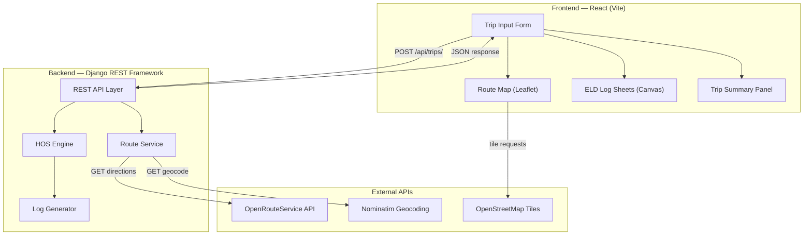
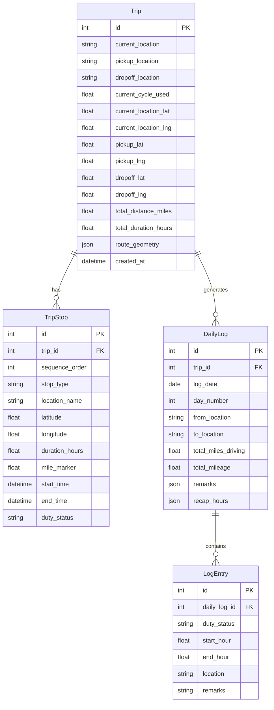
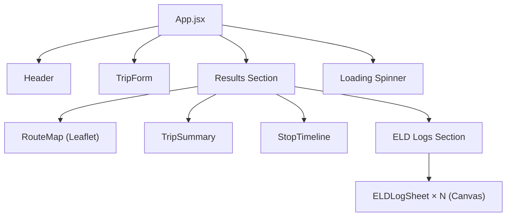
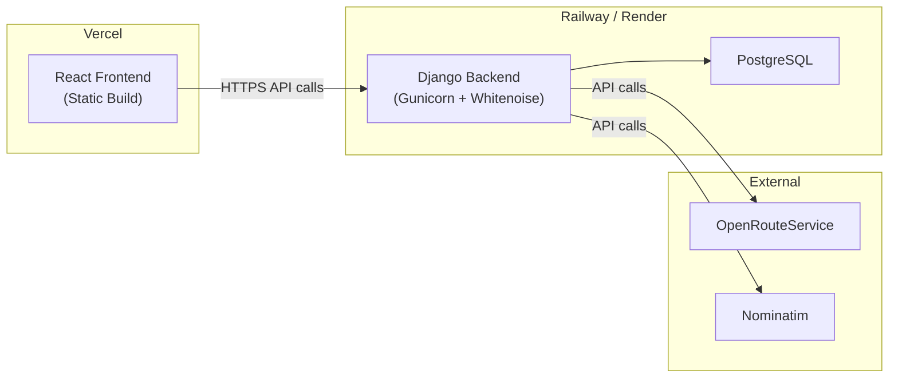

# 🏗️ Architecture — ELD Trip Planner

---

## High-Level Architecture



---

## Tech Stack

| Layer | Technology | Justification |
|---|---|---|
| **Frontend** | React 18 + Vite | Fast dev experience, modern tooling |
| **Styling** | Vanilla CSS + CSS Variables | Maximum control, no framework overhead |
| **Map** | React-Leaflet + Leaflet.js | Free, open-source, lightweight |
| **Map Tiles** | OpenStreetMap | Free, no API key needed |
| **Routing API** | OpenRouteService (ORS) | Free tier, truck routing profiles, directions API |
| **Geocoding** | Nominatim (OSM) | Free, no API key for low-volume |
| **ELD Drawing** | HTML5 Canvas API | Pixel-perfect control for grid drawing |
| **Backend** | Django 5.x + Django REST Framework | Assessment requirement, robust Python framework |
| **Database** | SQLite (dev) / PostgreSQL (prod) | Simple for assessment, scales for production |
| **Deployment - FE** | Vercel | Free tier, excellent for React/Vite |
| **Deployment - BE** | Railway or Render | Free tier, supports Django |

---

## Backend Architecture

### Django Project Structure

```
backend/
├── manage.py
├── requirements.txt
├── config/                     # Django project settings
│   ├── __init__.py
│   ├── settings.py
│   ├── urls.py
│   ├── wsgi.py
│   └── asgi.py
├── trips/                      # Main app
│   ├── __init__.py
│   ├── models.py               # Trip, Stop, DailyLog models
│   ├── serializers.py          # DRF serializers
│   ├── views.py                # API views
│   ├── urls.py                 # App URL patterns
│   ├── admin.py
│   ├── tests.py
│   └── services/
│       ├── __init__.py
│       ├── route_service.py    # OpenRouteService integration
│       ├── hos_engine.py       # HOS calculation engine
│       └── log_generator.py    # ELD log sheet data generator
└── utils/
    ├── __init__.py
    └── constants.py            # HOS constants & enums
```

### Data Models



### API Endpoints

| Method | Endpoint | Description | Request Body |
|---|---|---|---|
| `POST` | `/api/trips/` | Create a new trip, calculate route & HOS plan | `{ current_location, pickup_location, dropoff_location, current_cycle_used }` |
| `POST` | `/api/history/save/` | Explicitly save a trip to user history (MongoDB) | `{ trip_data: {...} }` |
| `GET` | `/api/history/` | List all saved previous trips (MongoDB) | — |
| `GET` | `/api/history/{id}/` | Retrieve full trip details for a specific history item | — |
| `DELETE`| `/api/history/{id}/` | Delete a saved trip from history | — |
| `POST` | `/api/auth/login/` | Authenticate and retrieve JWT token | `{ username, password }` |
| `POST` | `/api/auth/register/` | Register a new user account | `{ username, password, email }` |

### API Response Structure

```json
{
  "id": 1,
  "current_location": "Los Angeles, CA",
  "pickup_location": "San Francisco, CA",
  "dropoff_location": "Portland, OR",
  "current_cycle_used": 20,
  "total_distance_miles": 1085.5,
  "total_duration_hours": 18.2,
  "route_geometry": { "type": "LineString", "coordinates": [...] },
  "stops": [
    {
      "sequence_order": 1,
      "stop_type": "start",
      "location_name": "Los Angeles, CA",
      "latitude": 34.0522,
      "longitude": -118.2437,
      "duration_hours": 0.25,
      "mile_marker": 0,
      "start_time": "2026-08-05T08:00:00Z",
      "end_time": "2026-08-05T08:15:00Z",
      "duty_status": "on_duty"
    },
    {
      "sequence_order": 2,
      "stop_type": "pickup",
      "location_name": "San Francisco, CA",
      "duration_hours": 1.0,
      "duty_status": "on_duty"
    },
    {
      "sequence_order": 3,
      "stop_type": "rest_break",
      "location_name": "Near Redding, CA",
      "duration_hours": 0.5,
      "duty_status": "off_duty"
    },
    {
      "sequence_order": 4,
      "stop_type": "fuel",
      "location_name": "Near Medford, OR",
      "duration_hours": 0.5,
      "duty_status": "on_duty"
    }
  ],
  "daily_logs": [
    {
      "log_date": "2026-08-05",
      "day_number": 1,
      "from_location": "Los Angeles, CA",
      "to_location": "Near Redding, CA",
      "total_miles_driving": 580,
      "entries": [
        { "duty_status": "on_duty", "start_hour": 8.0, "end_hour": 8.25, "location": "Los Angeles, CA" },
        { "duty_status": "driving", "start_hour": 8.25, "end_hour": 14.5, "location": "En route" },
        { "duty_status": "on_duty", "start_hour": 14.5, "end_hour": 15.5, "location": "San Francisco, CA" },
        { "duty_status": "driving", "start_hour": 15.5, "end_hour": 19.75, "location": "En route" },
        { "duty_status": "off_duty", "start_hour": 19.75, "end_hour": 20.25, "location": "Near Redding, CA" },
        { "duty_status": "driving", "start_hour": 20.25, "end_hour": 22.0, "location": "En route" },
        { "duty_status": "sleeper_berth", "start_hour": 22.0, "end_hour": 24.0, "location": "Near Redding, CA" }
      ],
      "recap": {
        "hours_available": 50,
        "hours_used_today": 14,
        "cycle_total": 34
      }
    }
  ]
}
```

---

## Frontend Architecture

### React Project Structure

```
frontend/
├── index.html
├── vite.config.js
├── package.json
├── public/
│   └── favicon.ico
└── src/
    ├── main.jsx
    ├── App.jsx
    ├── index.css                  # Global styles & design tokens
    ├── components/
    │   ├── TripForm/
    │   │   ├── TripForm.jsx       # Input form with location fields
    │   │   └── TripForm.css
    │   ├── RouteMap/
    │   │   ├── RouteMap.jsx       # Leaflet map with route & markers
    │   │   └── RouteMap.css
    │   ├── ELDLogSheet/
    │   │   ├── ELDLogSheet.jsx    # Canvas-drawn ELD daily log
    │   │   └── ELDLogSheet.css
    │   ├── TripSummary/
    │   │   ├── TripSummary.jsx    # Stop/rest timeline
    │   │   └── TripSummary.css
    │   ├── StopTimeline/
    │   │   ├── StopTimeline.jsx   # Visual timeline of all stops
    │   │   └── StopTimeline.css
    │   ├── Header/
    │   │   ├── Header.jsx
    │   │   └── Header.css
    │   └── Loading/
    │       ├── Loading.jsx
    │       └── Loading.css
    ├── hooks/
    │   └── useTrip.js             # Custom hook for trip state
    ├── services/
    │   └── api.js                 # API client
    └── utils/
        ├── constants.js
        └── formatters.js
```

### Component Hierarchy



### State Management

Using React's built-in `useState` + `useReducer` (no external state library needed for this scope):

```
State Shape:
{
  tripInput: { currentLocation, pickupLocation, dropoffLocation, cycleUsed },
  tripResult: { route, stops, dailyLogs, totalDistance, totalDuration },
  loading: boolean,
  error: string | null,
  activeLogDay: number
}
```

---

## ELD Log Canvas Drawing Strategy

The ELD log grid is drawn on an HTML5 Canvas element. The approach:

1. **Draw the grid background**: 24 columns (hours), 4 rows (duty statuses), with midnight-to-midnight scale
2. **Draw time labels**: Midnight, 1, 2, ... 11, Noon, 1, 2, ... 11, Midnight
3. **Draw status labels**: Off Duty, Sleeper Berth, Driving, On Duty
4. **Draw 15-minute gridlines**: Each hour divided into 4 segments
5. **Draw duty status lines**: For each log entry, draw a horizontal line on the corresponding row at the correct time range
6. **Draw vertical transitions**: Connect status changes with vertical lines
7. **Calculate total hours**: Sum and display per-row totals on the right

---

## Third-Party Integration Details

### OpenRouteService (Directions)
- **Endpoint**: `POST https://api.openrouteservice.org/v2/directions/driving-hgv`
- **Profile**: `driving-hgv` (heavy goods vehicle — perfect for trucks)
- **Returns**: Route geometry (polyline), distance, duration, step-by-step instructions
- **Free Tier**: 2,000 requests/day

### Nominatim (Geocoding)
- **Endpoint**: `GET https://nominatim.openstreetmap.org/search`
- **Purpose**: Convert location names to lat/lng coordinates
- **Free**: Unlimited with polite usage (1 req/sec)

### OpenStreetMap (Map Tiles)
- **URL Template**: `https://{s}.tile.openstreetmap.org/{z}/{x}/{y}.png`
- **Free**: With attribution

---

## Deployment Architecture



### Environment Variables

| Variable | Service | Purpose |
|---|---|---|
| `ORS_API_KEY` | Backend | OpenRouteService API key |
| `DATABASE_URL` | Backend | PostgreSQL connection string |
| `SECRET_KEY` | Backend | Django secret key |
| `ALLOWED_HOSTS` | Backend | CORS and allowed hosts |
| `VITE_API_URL` | Frontend | Backend API base URL |

---

## Security Considerations

- All external API keys stored server-side only (Django)
- CORS properly configured for frontend domain only
- Input validation on all trip parameters
- Rate limiting on API endpoints
- CSRF protection enabled
